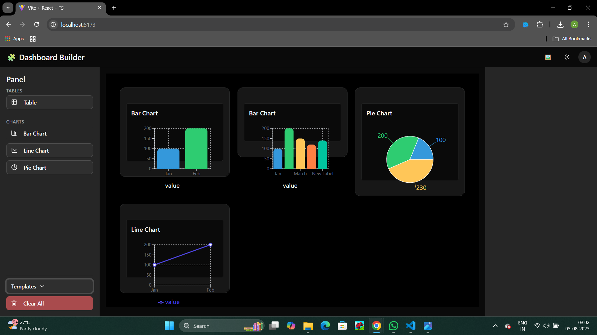

# 🧱 Collaborative Dashboard Builder

## 🚀 Project Overview

The Collaborative Dashboard Builder is a dynamic web application designed to help users **create and customize dashboards** with charts and tables using a drag-and-drop interface. This tool mimics the functionality of modern SaaS platforms like **Retool**, **Metabase**, and **Power BI**, offering a simplified, intuitive user experience.

This demo project was built as part of an assignment and focuses on **functionality, design**, and **extensibility**, while skipping complex features like authentication and real-time collaboration for now.

---

## 🛠 Tech Stack

| Layer         | Technology Used                          |
|---------------|------------------------------------------|
| Frontend      | React (Vite) + TypeScript                |
| UI Components | Tailwind CSS + ShadCN UI                 |
| State Mgmt    | Redux Toolkit                            |
| Layout Engine | react-grid-layout                        |
| Charts        | Recharts                                 |
| Utilities     | dom-to-image-more (for exporting canvas) |

---

## 🧠 Architecture 

- **Redux Toolkit** manages all widget data, settings, and layout state.
- **react-grid-layout** enables responsive drag-and-drop layout for dashboard customization.
- **ShadCN UI + Tailwind** provides clean and modern UI/UX out of the box.

---

## 💡 Features

- 🧩 Drag and drop widgets (chart, table) into the dashboard
- ⚙️ Click widgets to open a settings panel
- 📊 Editable chart data (bar, line, pie)
- 🗃 Editable table data
- 💾 Canvas export as PNG
- 💻 Responsive layout with grid snapping

---

## 🎯 Approach & Philosophy

We focused on building a **modular, scalable** architecture using industry standards:

- 🔄 **Redux** was chosen over local state for easier state sharing across complex nested components
- 🧱 **react-grid-layout** provides precise drag-and-drop control and layout persistence
- 💅 **Tailwind + ShadCN UI** ensures accessibility, responsiveness, and a clean developer experience
- 💡 Each widget (Chart, Table) is **self-contained**, making it easy to add more widget types in future (e.g., KPI cards, map views)

---

## 📈 Scalability & Future Improvements

This app is structured to be highly extensible:

| Feature                    | Current | Scalable With |
|---------------------------|---------|-----------------------------|
| User Authentication       | ❌      | Add Firebase/Auth0          |
| Dashboard Save/Load       | 🔜 LocalStorage | Add backend (MongoDB/Firebase) |
| Real-time Collaboration   | ❌      | Integrate WebSockets (e.g. Socket.io) |
| Multi-user dashboards     | ❌      | Add login + user-level data |
| Export to PDF             | ❌      | Add `jspdf` or server render |

You can easily plug in these features without rewriting core logic.

---

## 🖼️ Dashboard Preview

Here's a quick look at the Dashboard Builder in action:

🟢 The goal was to replicate a simplified version of professional dashboards using modern tooling in a short time.

---

## 🙋‍♂️ Team & Contributions

Built independently by **Ash Bagda** as part of a DelightLoop assignment.

---

## 📬 Feedback

If you'd like to explore how this can be scaled for production use (e.g., multi-user dashboards, backend sync, or live collaboration), feel free to connect!

